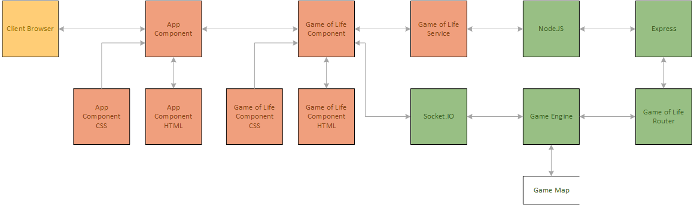

# Game of Life Challenge
## 1. Introduction
Conway’s Game of Life is a famous simulation that demonstrates cellular automaton. It is modeled as a grid with 4 simple rules:
1. Any live cell with fewer than two live neighbors die, as if caused by under-population.
2. Any live cell with two or three live neighbors lives on to the next generation.
3. Any live cell with more than three live neighbors dies, as if by overcrowding.
4. Any dead cell with exactly three live neighbors becomes a live cell, as if by reproduction.
## 2. Requirements
### 2.1. Functional Requirement
* Implement the Game of Life in browser.
* The browser connects to an HTTP server.
* This server allows multiple browser to share the same, synchronized world view.
* Each client is assigned a random color on initialization.
* From the browser, clicking on any grid will create a live cell on that grid with the client’s color.
* This change should be synchronized across all connected clients.
* When a dead cell revives by rule #4 “Any dead cell with exactly three live neighbors becomes a live cell, as if by reproduction.”, it will be given a color that is the average of its neighbors.
* include a toolbar that places some predefined patterns at random places with the player’s color.
# 3. System Design
## 3.1 Hardware Architecture
### Docker
The System is packaged into a docker container that helps developers easier to deploy on any machine and environment. In addition, I can offer Scalability with combining Cloud Services.
### GCP
The System is already deployed to GCP using GKE for Real-Time Testing. Using GCP can offer fast response, scalability and on-demand Pricing. In addition, it reduce much works from build a good infrastructure but results having an enterprise level Network at the same time.
## Software Architecture
### Overview

### Front End Web Application
#### Angular 4.0.0
This System is using Angular as Front End in order to offer a fast response to the User. In addition, Angular provide the framework that keeps those HTML and JavaScript easy to maintain because of the its Component Based Architecture.
### Node.js
At the backend, Node.js acts as an Application Server that accepts the http request, web-socket, etc... and provides Interface or Data Update to the User. Node.js provides very fast response to the request and fully utilizes the Hardware by its Non-Blocking I/O.
### Express
Express Framework is used behind Node.js. It helps developer to keep the maintainability of the codes by using the routes and helping developers to start a web server faster in Node.js by its API provided.
### Socket IO
Socket IO is initialized by Express Framework that provides an Web-Socket Interface to exchange real-time data for the Application, such as synchronize the Game Map between all connected clients.
### game-loop
game-loop is the module of Node.js that provides a very accurate tick to the System to update the Game Map internally.
## 4. Get Started
### 4.1 Prerequisites
#### Node.js
Install Node.js in order to run the Web Server Modeule.
You can download the Node.js from: https://nodejs.org/en/
#### Angular-CLI
Install Angular CLI to Compile the TypeScript into the front end files.
1. Open Terminal
2. Input Command "sudo npm install @angular/cli -g"
#### Opening Ports on Firewall
The System uses 3000 tcp on http communication and 4000 tcp on Web-Socket communication.
### 4.2 Running
1. Open Terminal
2. Go to Folder with the downloaded sources
3. Input Command "ng build"
4. Input Command "npm start"
5. Open a Browser enter address "http://{{your IP or domain}}:3000"
### 4.3 Enjoy
The Game will move 1 step per second. Just Enjoy what the game generate for you. or...
1. Clicking a Tile in the Game Map to add a Live Cell.
2. Clicking the Name of the Pre-defined Pattern to add in it into the Map with Random Location.
3. Dragging the Pattern into the Map to add the Pattern at the selected Location on the Map.
